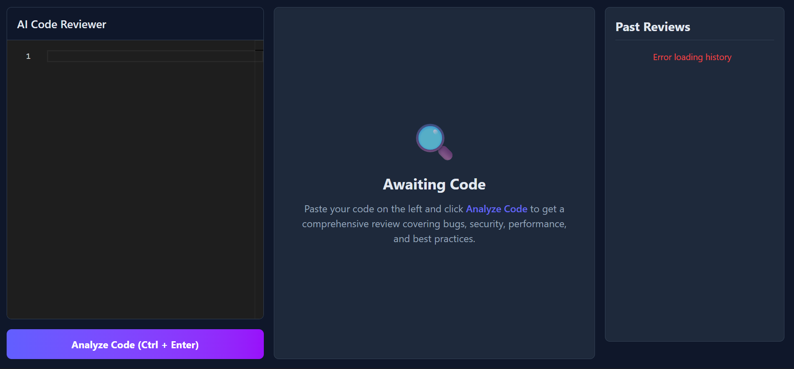

# AI Code Reviewer

An intelligent, full-stack application that acts as your personal expert code reviewer. Powered by the Anthropic Claude API, it automatically analyzes your code for bugs, security vulnerabilities, performance bottlenecks, and best practice violations.



## Tech Stack

| Layer | Technology |
|---|---|
| Frontend | React 19, Vite, Tailwind CSS v4, Monaco Editor |
| Backend | Node.js, Express.js |
| Database | MongoDB, Mongoose |
| Cache | Redis |
| Auth | JWT, bcryptjs |
| AI | Google Gemini 1.5 Flash API |

## Project Structure

```
ai-code-reviewer/
├── client/                  # React + Vite frontend
│   ├── src/
│   │   ├── components/
│   │   │   ├── AuthModal.jsx
│   │   │   ├── Editor.jsx
│   │   │   ├── History.jsx
│   │   │   ├── IssueCard.jsx
│   │   │   ├── ReviewPanel.jsx
│   │   │   └── ScoreCard.jsx
│   │   └── App.jsx
│   ├── .env
│   └── .env.example
└── server/                  # Node.js + Express backend
    ├── controllers/
    │   ├── authController.js
    │   └── reviewController.js
    ├── middleware/
    │   └── auth.js
    ├── models/
    │   ├── Review.js
    │   └── User.js
    ├── routes/
    │   ├── auth.js
    │   └── review.js
    ├── utils/
    │   └── cache.js
    ├── .env
    ├── .env.example
    └── server.js
```

## Setup

### Prerequisites

- Node.js 18+
- MongoDB Atlas account (free tier works)
- Google Gemini API key — [get one here](https://aistudio.google.com/app/apikey)
- Redis — optional, falls back gracefully if unavailable

### Installation

**1. Clone the repo**
```bash
git clone https://github.com/yourusername/ai-code-reviewer
cd ai-code-reviewer
```

**2. Setup server**
```bash
cd server
npm install
cp .env.example .env
# Fill in GEMINI_API_KEY, MONGO_URI, JWT_SECRET
node server.js
```

**3. Setup client**
```bash
cd client
npm install
cp .env.example .env
npm run dev
```

### Environment Variables

**Server (`server/.env`)**

| Variable | Required | Description |
|---|---|---|
| `GEMINI_API_KEY` | ✅ | Google Gemini API key |
| `MONGO_URI` | ✅ | MongoDB connection string |
| `JWT_SECRET` | ✅ | Secret for JWT signing (min 32 chars) |
| `REDIS_URL` | ❌ | Redis URL (optional, default: `redis://localhost:6379`) |
| `PORT` | ❌ | Server port (default: `5000`) |

**Client (`client/.env`)**

| Variable | Required | Description |
|---|---|---|
| `VITE_API_URL` | ✅ | Backend base URL (e.g. `http://localhost:5000`) |

## API Endpoints

| Method | Route | Auth | Description |
|---|---|---|---|
| `POST` | `/api/review` | Optional | Submit code for AI review |
| `GET` | `/api/history` | Optional | Fetch review history |
| `GET` | `/api/review/:id` | None | Fetch a specific review |
| `POST` | `/api/auth/register` | None | Register new user |
| `POST` | `/api/auth/login` | None | Login and get JWT token |
| `GET` | `/api/auth/me` | Required | Get current user info |

## Deployment

| Service | Platform |
|---|---|
| Frontend | [Vercel](https://vercel.com) |
| Backend | [Render](https://render.com) |
| Database | [MongoDB Atlas](https://www.mongodb.com/atlas) |
| Cache | [Redis Cloud](https://redis.io/cloud) (free tier) |

## Contributing

Pull requests are welcome. Please open an issue first to discuss what you'd like to change.

## License

[MIT](LICENSE)
